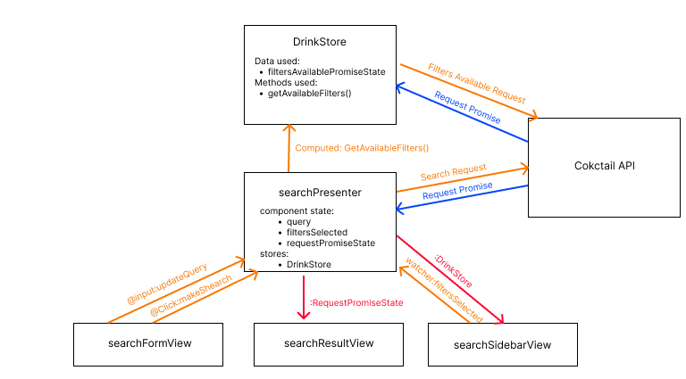

## DESCRIPTION ##
In simple terms Cocktail-o-Maker is an interactive website which allows the users to search for drink recipies.

However, it is a lot more than that. The users create an account, verify their age according to the drinking laws, 
and are able to favorise and rate drink recipies and ingredients.

It is also a space for the ones who want to make the most of what they have, since users will be able to list their 
ingredients that they have at home and find cocktails accordingly.


## What you have done ##
We have used the API , which provides data of the coctails such as the ingredients, measures, a picture etc. and 
based the website around this data.

Currently, we do not have users implemented but instead made a mockup to verify their age. 

Search of drinks implemented, drinkdetails are implemented and also able to save drinks to a mockup user.

## What you still plan to do ##
We still have to implement the user, the filter, a page for searching ingredients and the ranking system.

## PROJECT FILE STRUCTURE ##
We use a router for navigation between pages. We use presenters and views.
```bash
TopBar.vue (Shows the topbar with logout button)
├── presenters
│   ├── HomePagePresenter.vue (Shows the start page with a mock login/under 20 selector)
│   ├── detailsAPIPresenter.vue (Api call for the drinkdetails + addfavourite callback => detailsView.vue)
│   ├── searchPresenter.vue (Call API for search + display, send and get informations from the different search views)
│   └── userPresenter.vue (Showing username through userView.vue + Api call for the favourites => drinkThumb.vue)
└── views
    ├── detailsView.js  (redundant file..)
    ├── detailsView.vue (Displays the recipe for a drink)
    ├── drinkThumb.vue (Displays a single drink name and thumbnail)
    ├── ingredientThumb.vue (Displays a single ingredients name)
    ├── searchFormView.vue (Display an input box and search boutton, emit click and input event listeners)
    ├── searchResultView.vue (Display the data of the PromiseStateSearch saved in the component state of searchPresenter)
    ├── searchSidebarView.vue (Display the different filters available and emit an event listener when you update filters selected)
    └── userView.vue (Displays the username recieved from the presenter)
```
### searchPresenter workflow



## Project setup
```
npm install
```

### Compiles and hot-reloads for development
```
npm run serve
```

### Compiles and minifies for production
```
npm run build
```

### Lints and fixes files
```
npm run lint
```

### Customize configuration
See [Configuration Reference](https://cli.vuejs.org/config/).
